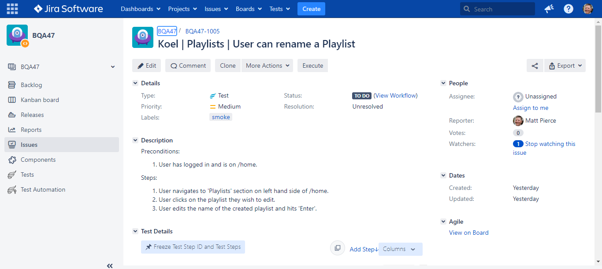
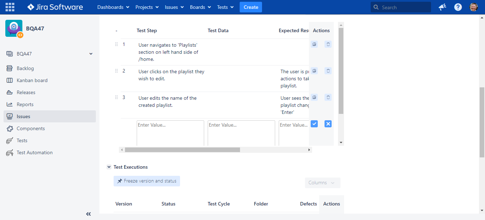

<h1>Test Case Example</h1>

<h2>Description</h2>
Project consists of an example of writing a Test Case using the critical elements such as:
Effective Title, Preconditions, Steps, Test Steps, Actual Result. This is a great example that highlights my ability to use Jira and Test Manager applications such as Zephyr.
 

<h2>Utilities Used</h2>

- <b>GitHub, Koel Music App, Jira, Zephyr, TestPro, Images</b>

<h2>Environments Used </h2>

- <b>Windows 10</b> (21H2)

<h2>Project walk-through:</h2>

Test Case including: Title, Preconditions, Steps to Test:  
   

 
 
Created Test in Zephyr including: Test Steps and Expected Result, 
   

 
 
